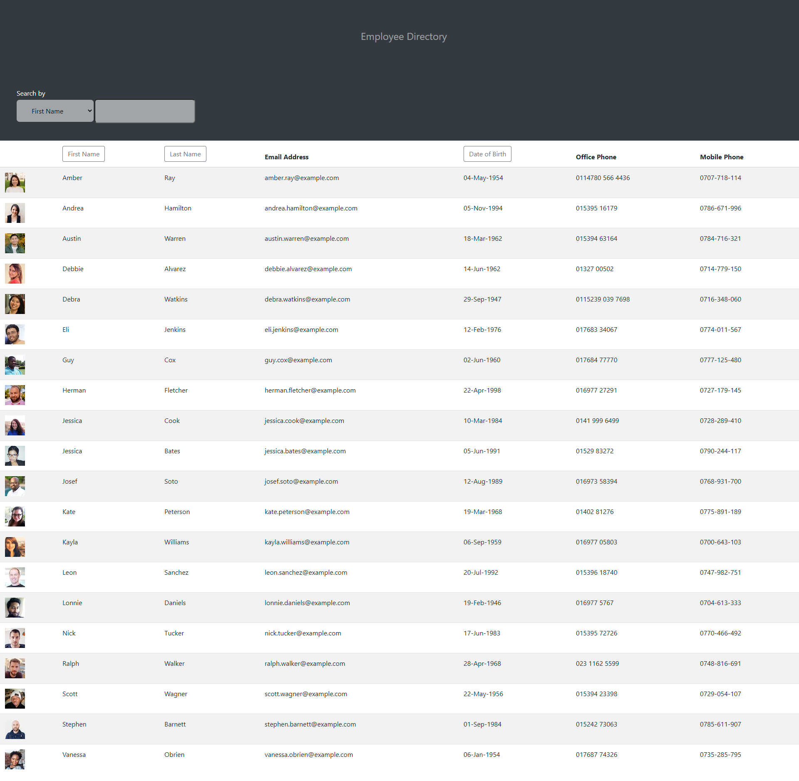
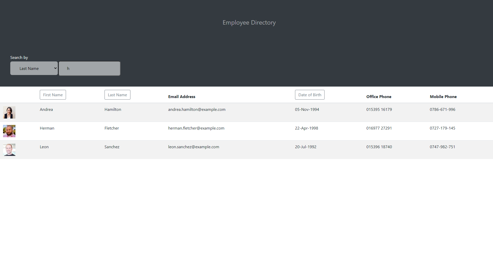

# Employee Directory  

## Description

A React application that allows the user to display a list of employees, along with various data about them, and to be able to search on these elements, as well as sort in alphabetical order on first name, last name, and to sort the date of birth from oldest to youngest.

## Table of Contents

  - [Employee Directory](#Employee-Directory)
  - [Description](##description)
  - [Table of Contents](##table-of-contents)
  - [Installation](##installation)
  - [Usage](##usage)
  - [License](##license)
  - [Contributors](##contributors)
  - [Technologies Used](##technologies-used)
  - [Future versions](##future-versions)

## Installation

It can be run locally from the github repository, or via the deployed application at github pages.

## Usage

The live deployed site is found at: https://clairemdavies.github.io/employee-directory/

A screenshot of the directory

A screenshot of the data being searched

## License

License with MIT

## Contributors

This app is the sole work of [Claire Davies](https://github.com/ClaireMDavies)

## Technologies Used

- Javascript
- node.js
- React
- HTML
- CSS
- Bootstrap
- moment package
- axios package
- [Random User API](https://randomuser.me/)
- Github Pages
- Github

## Future Versions

There was a great deal of scope with this project to add extra features.  Given more time I would look into the sort functionality being reversable, so sorting from z-a or from youngest to oldest. 

Other things I would like to work on is the UI, and as I have ideas as to what could be done to make it look more stylish. 
  